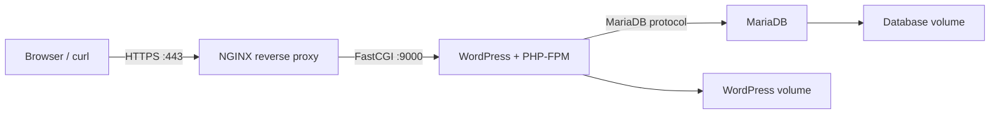

# Inception42

A 42 Berlin infrastructure project that builds a small HTTPS web stack with Docker Compose.

The stack uses custom Docker images for an NGINX reverse proxy, WordPress with PHP-FPM, and MariaDB. Makefile commands provide a repeatable local workflow for building, starting, inspecting, and removing the services.

## Architecture



## Stack

- Docker and Docker Compose
- NGINX as the only public entry point
- TLS 1.2 / TLS 1.3 with a self-signed certificate
- WordPress served through PHP-FPM
- MariaDB database
- Named Docker volumes for persistence
- Isolated Docker network
- Makefile automation

## Repository structure

```text
srcs/docker-compose.yml
srcs/requirements/nginx/
srcs/requirements/wordpress/
srcs/requirements/mariadb/
Makefile
USER_DOC.md
DEV_DOC.md
```

## Prerequisites

- Linux or a Linux virtual machine
- Docker Engine
- Docker Compose v2
- GNU Make
- Permission to update `/etc/hosts`

## Configuration

Create `srcs/.env` with local development values. Use placeholders and do not commit the file:

```env
DOMAIN_NAME=your-local-domain.test
DB_NAME=wordpress
DB_USER=wordpress_user
DB_PASS=replace-with-a-local-password
DB_HOST=mariadb
WP_ADMIN_USER=admin
WP_ADMIN_PASS=replace-with-a-local-password
WP_ADMIN_EMAIL=admin@example.test
WP_USER=editor
WP_USER_PASS=replace-with-a-local-password
WP_USER_EMAIL=editor@example.test
MARIADB_DATABASE=wordpress
MARIADB_USER=wordpress_user
MARIADB_PASSWORD=replace-with-a-local-password
MARIADB_ROOT_PASSWORD=replace-with-a-local-root-password
```

The current Makefile and NGINX configuration use the 42 project domain. See `USER_DOC.md` and `DEV_DOC.md` for the exact local host setup.

## Run

```bash
make build
```

Other useful commands:

```bash
make ps
make logs
make down
make re
```

`make fclean` removes Docker resources and volumes. Use it carefully because persisted database and WordPress data will be deleted.

## Inspect and test

Check service state:

```bash
docker compose -f srcs/docker-compose.yml ps
```

Follow logs:

```bash
docker compose -f srcs/docker-compose.yml logs -f
docker logs nginx
docker logs wordpress
docker logs mariadb
```

Test the HTTPS entry point:

```bash
curl -k https://mkokorev.42.fr
```

Test internal service health:

```bash
docker exec -it wordpress nc -z localhost 9000
docker exec -it mariadb mysqladmin ping -h localhost -uroot -p
```

## Documentation

- `USER_DOC.md` - daily operation and service checks
- `DEV_DOC.md` - environment setup, containers, volumes, and persistence

## Status and limitations

- Built for the 42 Inception project and local/VM use.
- Uses a self-signed TLS certificate.
- The Makefile contains machine-specific paths and project-domain assumptions.
- This is a learning infrastructure stack, not a production deployment template.
